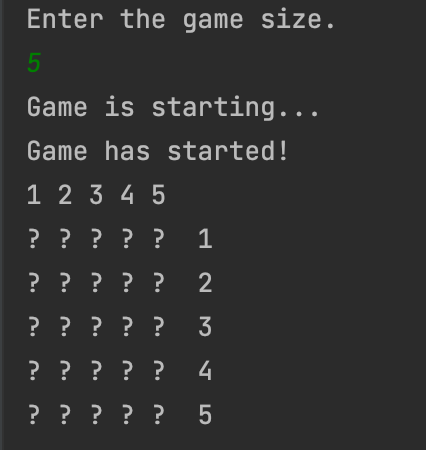
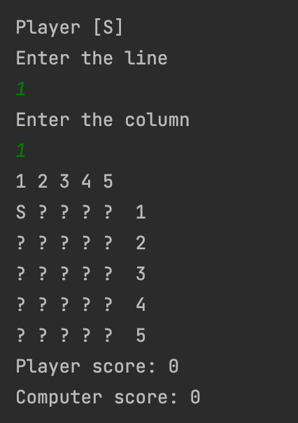
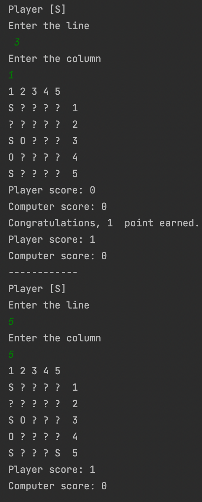
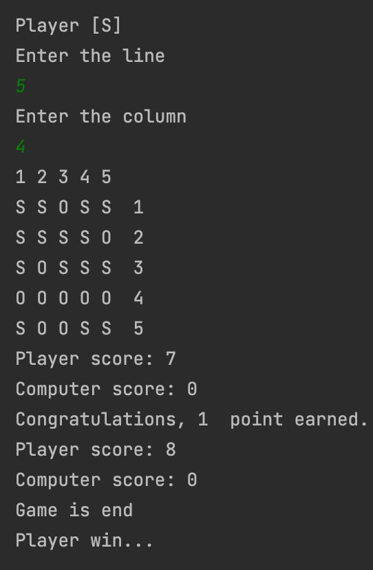

# Sos game
SOS game with Java

##### The player is prompted for the size of the game. The game starts when the player enters the size of the game.

#### The game starts with a random letter. The player whose turn it is to move makes a move by entering rows and columns. After the move, the standings are shown.

#### The person who makes a move and makes the word SOS gains 1 point and gets the right to make a move.

#### When there is no empty space in the game matrix, the game is over and the score is calculated. The winner is shown.

